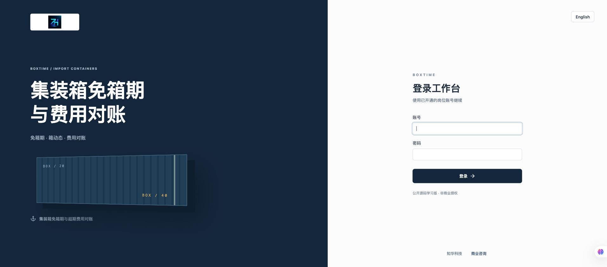
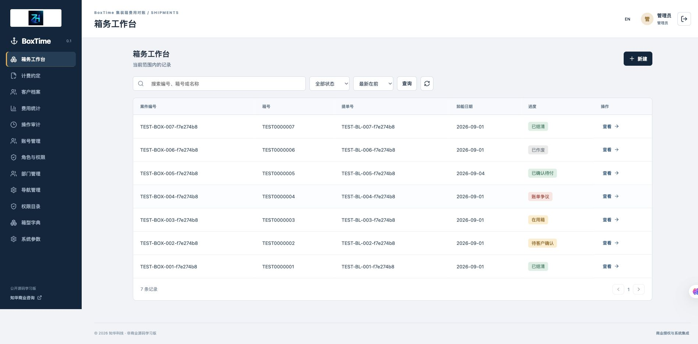
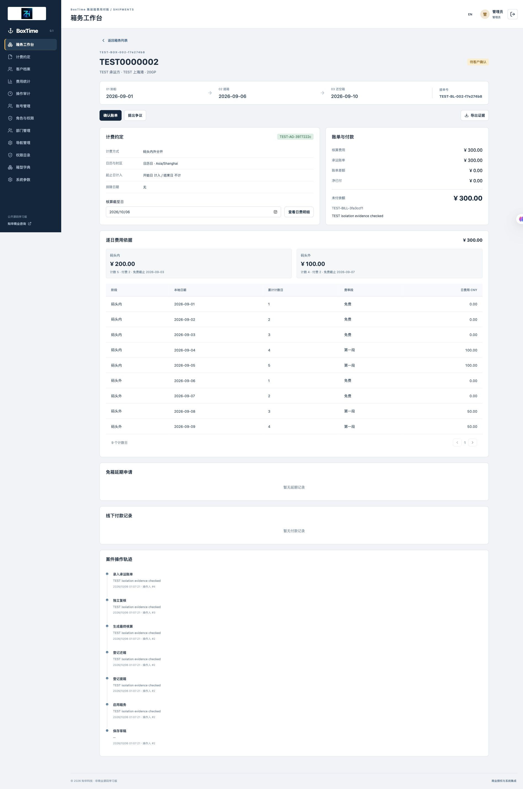
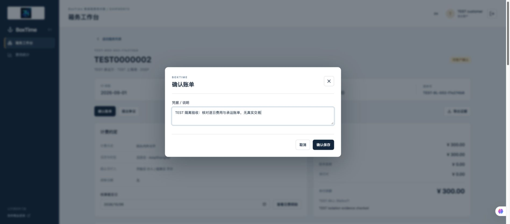
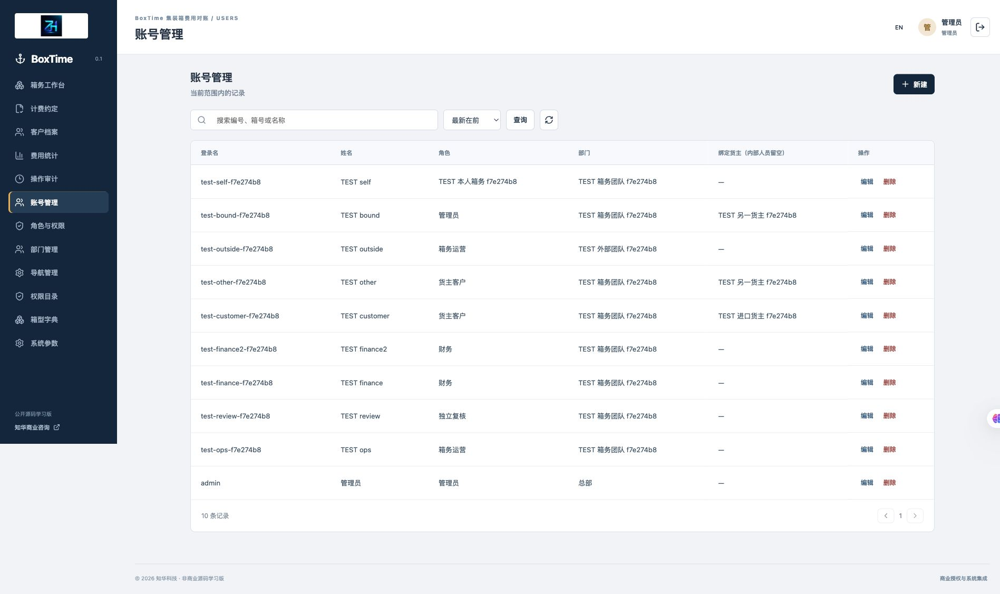
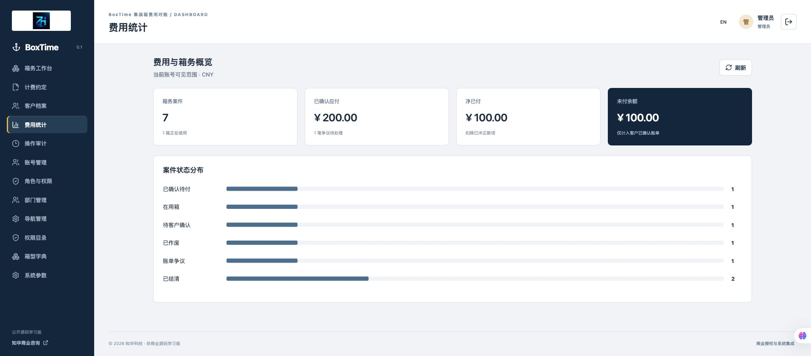
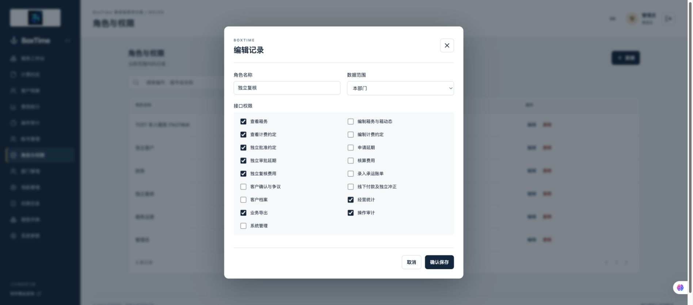
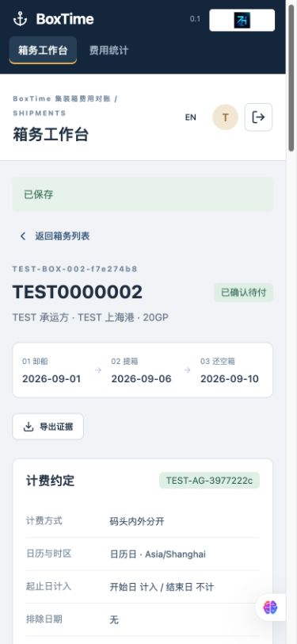

[中文](README.md) | [English](README.en.md)

# BoxTime · Container Free-Time and Demurrage/Detention Reconciliation


**ZhiHua Technology (Shanghai Rujing Zhihua Information Technology Co., Ltd.)** · [Official website](https://www.zhuatech.cn/).

**Public source for learning 0.1.0 / non-commercial use.** Java 21, Spring Boot, Vue 3, MySQL and Flyway support import-container milestones, contract free-time, daily charges, independent review, carrier bill disputes and manual payment records.

The project's own source is for personal learning, technical research and non-commercial exchange. Commercial use requires written authorization from Shanghai Rujing Zhihua Information Technology Co., Ltd. [LICENSE](LICENSE) is a non-commercial source license, not an OSI open-source license. [Third-party notices](THIRD_PARTY_NOTICES.md) retain separate terms. The system does not supply official carrier tariffs or replace transport contracts, formal bills or accounting software.

## Business and implemented functions

Cargo owners, forwarders, container operators, reviewers and finance staff reconcile agreed free-time, extension evidence, daily charges and carrier bills in one case. Each case represents one container; multiple containers on a bill of lading require separate cases. Demurrage, detention and combined charging have different periods. Responsible staff must verify the actual contract's dates, calendar and rates; no carrier quote is imported or assumed.

| Area | Implemented behavior |
| --- | --- |
| Customers | Create/edit/enable/disable, delete if unreferenced and protect department ownership |
| Agreements | Draft editing/cancellation, independent approval, valid dates, port time zone and container type; approved prices freeze |
| Rules | Separate/combined modes, calendar/weekday counting, excluded dates, endpoint inclusion, phase free days and two paid-rate tiers |
| Container cases | Draft edit, activation, gate-out, empty return, cancellation, agreement snapshots and date/number checks |
| Extensions | Phase-specific requests, independent approval/rejection and evidence notes; pending requests block final calculation |
| Calculation | Live as-of estimates, final daily detail after return and independent review |
| Bills | Actual amount/reference, explained differences, owner confirmation/dispute, revision and renewed confirmation |
| Payments | Partial completed-offline-payment records, overpayment/duplicate-reference checks and independent reversal restoring balance |
| Queries | Case/container/bill-of-lading search, state filters, pagination, reference/newest sort and scope-limited statistics |
| Export | Agreement/case JSON with snapshots, daily charges, extensions, payments and retained operation events |
| Administration | Accounts/passwords, roles, registered API permissions, menus, departments, container dictionaries, parameters and audit |
| Interfaces | Chinese/English, desktop/mobile, role navigation and bound-owner isolation |

An empty database initializes administration, roles, permissions, menus, container types and settings. It creates no business examples or customers. Acceptance records and screenshots use labeled synthetic TEST data.

## Charging, approvals and evidence

- Demurrage: arrival/unloading → gate-out. Detention: gate-out → empty return. Combined: arrival → return. Agreements control inclusion of each endpoint; default includes the start and excludes the end, so gate-out belongs only to detention in separate mode.
- Free and paid days use the same calendar; excluded dates are skipped in both modes. `WORKDAY` means Monday–Friday, without statutory holiday or compensating-workday interpretation. Replacement workdays, exclusions affecting only free-time and discontinuous tariffs are unimplemented.
- First `tierDays` paid days use the first rate, then the later rate. Approved extensions add to original free-time; displayed cutoffs are calculated agreement values.
- One phase per case can have at most one pending or approved extension; rejected requests can be resubmitted. Free-time plus extension is at most 730 days, one extension at most 365, excluded dates at most 200 and charging period at most five years. Amounts are CNY/two decimals; each input is capped at CNY 100 million.
- Milestones are manually entered port-local dates, not vessel-track timestamp conversion. Dates must follow sequence and not exceed today in that zone. Container numbers validate only four letters and seven digits, not an ISO check digit.
- Approved agreements and case snapshots survive master edits. Submitted milestones cannot be directly edited. Before calculation, incorrect draft/active cases can be canceled with evidence and recreated under a new reference. Returned cases cannot be rolled back; original history remains.
- One agreement/bill-of-lading/container combination can have only one noncanceled case. Case, agreement and payment references are globally unique. Bill differences require explanation and renewed confirmation. Payment records do not initiate transfers.
- Independence checks use account identity. Administrators must ensure different actual people own accounts; multiple accounts held by one person are not detectable. Authorized internal staff may record completed external customer confirmation with evidence, but cannot self-confirm a bill they entered.
- Commands carry a current version and UUID. Stale versions reject; an exact UUID/payload retry does not execute twice and returns the current record. UUID binds account, object, action and full payload. Changing UUID is not undo.
- A global administration lock serializes writes. Agreements and cases each have `maxShipments`, default 1,000 and configurable 100–1,000; directories cap at 10,000. Lists filter authorization before in-memory pagination. Large-scale production performance is unverified.

## Operators, owners and administrators

| Initial role | Responsibilities |
| --- | --- |
| Administrator | Administration/business operations, still subject to independence and owner bindings |
| Container operator | Agreements/cases, milestones, extensions, calculation and bill preparation |
| Independent reviewer | Agreement/extension approval and calculation review |
| Finance | Customers, bills, offline-payment records and independent reversal |
| Cargo owner | Bound customer cases, extensions, confirmation/disputes, statistics and exports |

API checks are independent of buttons. `ALL` covers all departments, `DEPARTMENT` the account's department, `SELF` cases/agreements created by that account. Customer binding overrides role scope: only that owner in the same department is readable, and internal operations, administration and audit are blocked even with an ALL administrator role. External-owner accounts must be bound; an unbound customer role behaves as an internal SELF account and should not be issued externally.

Roles/enablement apply on subsequent requests; changed passwords invalidate old sessions. The last enabled, unbound ALL administrator is protected. [Operations](docs/操作手册.md) and [API reference](docs/接口说明.md) provide detailed Chinese instructions.

## Actual running screens

Current application screenshots use synthetic TEST records in an isolated acceptance database.

Login offers authentication/language selection; the workbench summarizes authorized cases, charges and pending work.





Case detail shows agreement snapshots, gate-out/return facts, extensions and daily free/paid amounts. Owner confirmation records a decision or dispute without executing payment.





Administration maintains staff and customer bindings. Statistics include confirmed bills and offline payment records in the current scope.





Roles configure registered permissions/scopes; customer binding remains stronger. Mobile uses the same workflow with no additional integration.





## Architecture, directories and environment

| Layer | Version / responsibility |
| --- | --- |
| Backend | Java 21, Maven 3.9, Spring Boot 4.0.7, Security, JPA and Flyway |
| Database | MySQL 8.4, compatible MariaDB JDBC 3.5.10 driver and versioned SQL |
| Frontend | Node.js 24.19.0+, npm 11, Vue 3.5.40, Vite 8.1.5 and Lucide 1.48 |
| Deployment | Docker Engine/BuildKit, Compose v2, Nginx 1.29, non-root applications and persistent MySQL volume |
| Verification | Python 3.10+, H2 compatibility tests and separate real-MySQL acceptance |

Browser → Nginx same-origin `/api` → Spring Boot → MySQL. Cookie sessions/CSRF protect writes; money uses BigDecimal, evidence UTC microseconds and charging port-zone LocalDate. Shared ZhiHua identity/deployment code is reused; container rules/pages are separate. See [architecture](docs/架构说明.md) for the global READ_COMMITTED lock and payload-bound retry records.

```text
backend/src/main/java/cn/zhuatech/boxtime/   Business, identity and API
backend/src/main/resources/db/migration/  V1 identity and V2 container schema
backend/src/test/                         Charging and HTTP/JPA tests
frontend/src/                            Vue workflows and frontend tests
frontend/public/brand/                   Logo and original Chinese contact assets
scripts/                                Environment generation and validation
compose.yaml                            MySQL, backend and frontend
```

## Install and initialize the database

Install Docker Desktop/Engine, Compose v2 and Python 3.10+. Initial dependencies/images need network access. From the root:

```sh
python3 scripts/init-env.py
docker compose config --quiet
docker compose up -d --build --wait
docker compose ps
```

The script creates independent random database/root/admin passwords in ignored `.env`, mode 0600, without overwriting an existing file. Account: `admin`; password: local `ADMIN_PASSWORD`, with no fixed default. Create separate operators/reviewers before business setup; a single admin cannot approve their own agreement.

Open [http://127.0.0.1:8126/](http://127.0.0.1:8126/) and select English. Health: [http://127.0.0.1:8126/actuator/health](http://127.0.0.1:8126/actuator/health). Frontend binds localhost; backend/database have no host ports.

Database `zhuatech_boxtime`, internal account `boxtime`. Flyway applies [V1 identity](backend/src/main/resources/db/migration/V1__identity.sql) and [V2 container schema](backend/src/main/resources/db/migration/V2__container_time.sql) on an empty database; Hibernate validates only. Tables include identity/audit, customers, agreements, cases, extensions, payments, retry commands and events. No business examples initialize. Restarts and password environment changes do not reset existing accounts/data.

Workflow: customer → agreement → another person's approval → case → activation → gate-out/return → extensions → calculation → independent review → bill → owner confirmation/dispute → recorded offline payment.

## Configuration and source development

[.env.example](.env.example) provides names without real credentials.

| Variable | Use |
| --- | --- |
| `DATABASE_PASSWORD` / `MYSQL_ROOT_PASSWORD` | Required independent application/root database passwords |
| `ADMIN_PASSWORD` | Initial empty-database administrator password |
| `WEB_PORT` / `BIND_ADDRESS` | Default `8126` / `127.0.0.1` |
| `COOKIE_SECURE` | Local HTTP `false`; trusted HTTPS deployment `true` |
| `DATABASE_URL` / `DATABASE_CATALOG` / `DATABASE_USER` | Direct-backend overrides matching the selected database/migration catalog |

Source development needs Java 21, Maven 3.9, Node.js 24.19.0+ and a separately reachable MySQL test database with database/admin variables supplied; default Compose does not expose MySQL. From the root in one terminal run `cd backend` then `mvn spring-boot:run`. In another terminal from the root run `cd frontend`, `npm ci`, `npm run dev`. Vite binds localhost and proxies backend 8080.

## Tests and builds

Dockerfiles run backend/frontend tests. H2 results are separate from MySQL acceptance. From the repository root:

```sh
mvn -B -f backend/pom.xml spotless:check test package
cd frontend
npm ci --no-audit --no-fund
npm run format:check
npm run lint
npm test
npm run build
cd ..
docker compose config --quiet
git diff --check
```

Formatting: `mvn -f backend/pom.xml spotless:apply` and `npm --prefix frontend run format`. Prepare private configuration/a unique port and run writing acceptance only against a new disposable database:

```sh
docker compose -p boxtime-check config --quiet
docker compose -p boxtime-check up -d --build --wait
python3 scripts/smoke.py --allow-test-writes
python3 scripts/smoke.py --verify
python3 scripts/release-check.py
```

The script defaults to 8126; set `TEST_URL` to your isolated instance if changing the port. Ignored `output/qa-state.json` contains synthetic passwords/response snapshots for restart and restore checks; do not share it. Two instances cannot share one host port. A recovery example uses a separate project, `WEB_PORT=18126` and `TEST_URL=http://127.0.0.1:18126`.

Checks cover complete workflow, calendar/rate boundaries, independence, customer/department scopes, CSRF, stale versions, retries, competing payments and references. Report actual results and checks not performed.

## Deployment, upgrades and recovery

Public deployment needs trusted TLS, explicit `COOKIE_SECURE=true`, controlled accounts, protected backups and operations monitoring. Local defaults are for learning. Keep credentials, customers, unredacted logs and backups out of Git. Sessions last 30 minutes with HttpOnly/SameSite Strict; BCrypt cost 12 and login-failure limiting protect identity. See [security](docs/安全说明.md).

Back up and validate independent restoration before upgrades. Preserve MySQL volumes and add Flyway versions; never edit applied V1/V2 scripts. `docker compose down` retains data; `down -v` deletes it and must not be used on business volumes. For deliberate restart: MySQL → wait healthy → backend → wait healthy → frontend to refresh its upstream address.

Restore into a new project/empty volume with matching application/database versions. Start MySQL only, wait healthy, import a protected backup, then start backend/frontend and verify the existing private acceptance state. Only disposable test resources may be cleaned afterwards. Detailed backup/import commands are in the Chinese [deployment manual](docs/部署手册.md); backups contain sensitive business/account data.

For failed startup inspect this project's redacted health/logs and migration versions. Change `WEB_PORT` for a conflict without stopping unrelated services. Refresh stale records rather than bypassing versions; independent-review errors require another authorized person; resolve pending extensions first. Preserve original evidence for disputed facts.

## Limits, contributions and licensing

No carrier API, GPS/AIS, paid SMS/email, payment gateway, invoice system or bank calls are integrated, and no external API configuration is required. Export containers, storage charges, statutory-holiday calendars, arbitrary multi-tier tariffs, foreign currencies/exchange, attachments, contract OCR, scheduled reminders, returned-event rollback and accounting entries are unimplemented. Manually entered references/notes do not verify attachments or transactions. Global locking, directory limits and one currency require assessment before broader deployment.

Use Issues for reproducible questions with synthetic/anonymized data. Contributions should explain states, charges, permission effects, validation and third-party terms; see [contribution guide](CONTRIBUTING.md). Security reports go privately to the company, without publicly exposing credentials or backups. The own-source [LICENSE](LICENSE) requires written commercial authorization and does not replace dependency licenses or provide free commercial MIT/Apache rights.

## Contact ZhiHua Technology

**ZhiHua Technology (Shanghai Rujing Zhihua Information Technology Co., Ltd.)** · [https://www.zhuatech.cn/](https://www.zhuatech.cn/).

For commercial licensing, customization, deployment and system integration:

- Email: [han@zhuatech.cn](mailto:han@zhuatech.cn)
- Email: [jack@zhuatech.cn](mailto:jack@zhuatech.cn)
- WhatsApp: [+86 17521234993](https://wa.me/8617521234993)

Brand contacts and source licensing apply separately; contact information grants no commercial rights.
